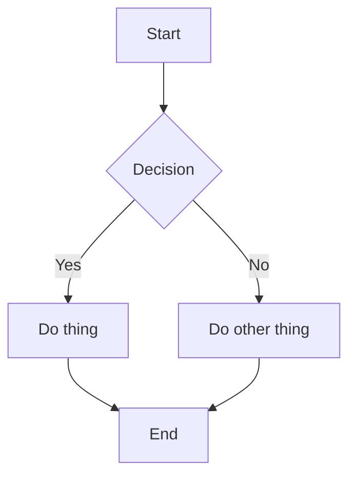
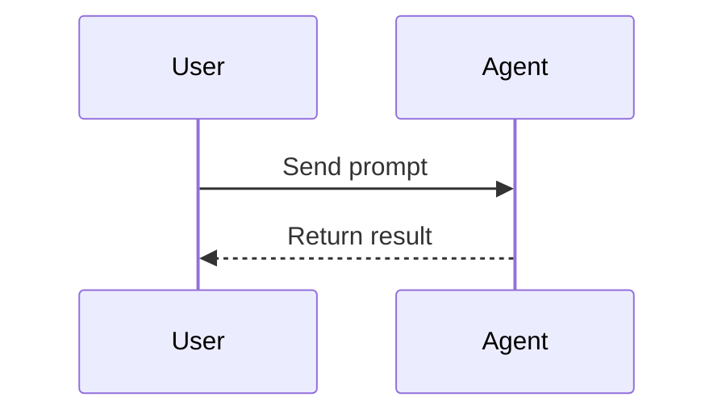

# Markdown Renderer Test Suite

One file to diff rendering across apps side by side — ordered from core CommonMark → GFM → common extensions. Not every renderer supports everything below; that gap is the point of the test.

***

## 1. Headings

# H1 heading

## H2 Heading

### H3 heading

#### H4 heading

##### H5 heading

###### H6 heading

# Setext H1

## Setext H2

***

## 2. Emphasis

*italic asterisk* and _italic underscore_

**bold asterisk** and __bold underscore__

***bold italic asterisk*** and ___bold italic underscore___

~~strikethrough~~ (GFM)

Combined: **bold _nested italic_ text** and *italic **nested bold** text*

Mid-word emphasis: fo*o*bar (should NOT render with underscore: fo\_o\_bar)

***

## 3. Paragraphs & Line Breaks

This is paragraph one.
This is still paragraph one (soft line break — should render as space or newline depending on renderer).

This is paragraph two, after a blank line.

This line ends with two trailing spaces for a hard break.\
This should be on a new line.

This line ends with a backslash for a hard break.\
This should also be on a new line.

***

## 4. Blockquotes

> Single-level blockquote.

> Multi-line blockquote
> spanning several lines
> of the same quote.

> Level 1
>
> > Level 2 nested
> >
> > > Level 3 nested

> Blockquote containing **bold**, *italic*, and `inline code`.
>
> With a second paragraph inside the same blockquote.

> ### Heading inside a blockquote
>
> * list item inside blockquote
> * another item

***

## 5. Lists

### 5.1 Unordered

* Item one
* Item two

- Item using asterisk marker

* Item using plus marker

- Item with **bold** and `code`
- Multi-line item
  continuation text indented under it

### 5.2 Nested unordered

* Level 1
  * Level 2
    * Level 3
      * Level 4

### 5.3 Ordered

1. First item
2. Second item
3. Third item
4. Item ten (tests marker width handling)

### 5.4 Ordered starting at arbitrary number

5. Starts at five
6. Continues at six

### 5.5 Nested ordered inside unordered (and vice versa)

1. Ordered top
   * Unordered nested
   * Another nested
2. Ordered top two
   1. Ordered nested
   2. Ordered nested two

### 5.6 Task list (GFM)

* [x] Completed task
* [X] Completed task (capital X)
* [ ] Incomplete task
* [ ] Incomplete task with **bold**
  * [x] Nested completed subtask
  * [ ] Nested incomplete subtask

### 5.7 Loose vs tight lists

Tight list (no blank lines between items):

* one
* two
* three

Loose list (blank lines between items):

* one

* two

* three

***

## 6. Code

### 6.1 Inline code

Use the `useState()` hook. Backtick containing a literal backtick: `` `backtick` ``.

### 6.2 Indented code block (4-space, legacy CommonMark)

```
function legacy() {
  return "indented code block";
}
```

### 6.3 Fenced code block, no language

```
plain fenced block
no syntax highlighting expected
```

### 6.4 Fenced code block, with language (syntax highlighting test)

```js
function greet(name) {
  const msg = `Hello, ${name}!`;
  console.log(msg);
  return msg;
}
```

```python
def greet(name: str) -> str:
    msg = f"Hello, {name}!"
    print(msg)
    return msg
```

```go
func Greet(name string) string {
	msg := fmt.Sprintf("Hello, %s!", name)
	fmt.Println(msg)
	return msg
}
```

```bash
#!/usr/bin/env bash
for f in *.md; do
  echo "Processing $f"
done
```

```json
{
  "name": "glean",
  "version": "0.1.0",
  "nested": { "array": [1, 2, 3], "bool": true, "null": null }
}
```

```yaml
name: test
on: [push]
jobs:
  build:
    runs-on: ubuntu-latest
```

```diff
- removed line
+ added line
  unchanged line
```

### 6.5 Fenced with tildes

```
tilde-fenced code block
```

### 6.6 Tab-indented code block

	function tabbed() {
	  return "indented with a real tab, not spaces";
	}

***

## 7. Horizontal Rules

Three dashes:

***

Three asterisks:

***

Three underscores:

***

Spaced asterisks:

***

***

## 8. Links

Inline link: [OpenAI's competitor](https://www.anthropic.com)

Inline link with title: [Anthropic](https://www.anthropic.com "Anthropic homepage")

Reference-style link, definition below: [Claude][claude-ref]

Shortcut reference link (label = text, definition below): [Claude]

Autolink (angle brackets): <https://www.anthropic.com>

Bare autolink (GFM, no angle brackets): https://www.anthropic.com

Autolink email (angle brackets): <test@example.com>

Bare autolink email (GFM): test@example.com

Relative link: [go to section 9](#9-images)

Link containing formatting: **[bold link text](https://example.com)**

[claude-ref]: https://claude.ai "Claude AI"
[Claude]: https://claude.ai "Claude AI (shortcut definition)"

***

## 9. Images

Inline image with alt text:


Reference-style image:

![Alt ref image][img-ref]

Image as a link (clickable image):

[](https://www.anthropic.com)

Image with explicit dimensions (kramdown/some parsers only):


[img-ref]: https://placehold.co/100 "Referenced image"

***

## 10. Tables (GFM)

| Left aligned | Center aligned | Right aligned |
| :----------- | :------------: | ------------: |
| a            |        b       |             c |
| longer cell  |        x       |           123 |

Table with inline formatting in cells:

| Feature                     | Supported | Notes               |
| --------------------------- | :-------: | -------------------- |
| **Bold**                    |     ✅     | works inline        |
| `code`                      |     ✅     | inline code in cell |
| [link](https://example.com) |     ✅     | link in cell        |
| ~~strike~~                  |     ❓     | depends on renderer |

Table without leading/trailing pipes:

| col1 | col2 | col3 |
| ---- | ---- | ---- |
| a    | b    | c    |

Table cell with a forced line break:

| Column | Content |
| ------ | ------- |
| A      | line one<br>line two |

***

## 11. Escaping & Special Characters

Escaped characters: \* \_ \` # \[ ] ( ) \ \~ >

Literal asterisks without emphasis: \*not italic\*

HTML entities: © & < > — …

Raw ampersand and less-than: Q\&A, 5 < 10

***

## 12. Raw HTML (inline & block)

Inline HTML: This is <strong>strong via raw HTML</strong> and <em>em via raw HTML</em>, plus a <sub>subscript</sub> and <sup>superscript</sup>.

Keyboard, insert, underline: press <kbd>Ctrl</kbd>+<kbd>C</kbd>, this is <ins>inserted text</ins>, this is <u>underlined text</u>.

Block-level raw HTML:

<div style="border:1px solid #ccc; padding:8px;">
  <p>A raw HTML block with a nested paragraph.</p>
</div>

<details>
<summary>Click to expand (HTML details/summary)</summary>

Hidden content revealed on click, including a nested list:

* item a
* item b

</details>

A line break via raw tag: line one<br />line two

***

## 13. Footnotes (extended syntax)

Here is a claim needing a citation.[^1] Here is another one.[^note]

Some parsers also support inline footnotes.^[This footnote is written inline, no reference label needed.]

A footnote referenced twice, should render once with two backlinks.[^shared] Second use of the same note.[^shared]

An unused, dangling footnote definition (should render nowhere, or as an error, depending on the parser).[^unused]

[^1]: This is the first footnote.

[^note]: This is a named footnote with **formatting** and a [link](https://example.com).

[^shared]: Shared footnote content.

[^unused]: This definition has no matching reference in the text.

***

## 14. Definition Lists (extended syntax)

Term 1
: Definition for term 1.

Term 2
: Definition A for term 2.
: Definition B for term 2 (multiple defs).

***

## 15. Superscript / Subscript (extended syntax)

Water is H~2~O. Einstein's equation is E=mc^2^.

***

## 16. Highlight / Mark (extended syntax)

This is ==highlighted text== using the mark extension.

***

## 17. Emoji Shortcodes (GFM-adjacent)

Shortcodes: `:rocket:` `:tada:` `:warning:` `:white_check_mark:` `:bug:`

Literal unicode emoji (should always render regardless of plugin support): 🚀 🎉 ⚠️ ✅ 🐛

***

## 18. Abbreviations (extended syntax)

The HTML spec is maintained by W3C.

*[HTML]: Hyper Text Markup Language
*[W3C]: World Wide Web Consortium

***

## 19. Math (KaTeX / MathJax extension)

Inline math: $E = mc^2$ and $\alpha + \beta = \gamma$.

Block math:

$$
\int_{-\infty}^{\infty} e^{-x^2} \, dx = \sqrt{\pi}
$$

$$
\begin{aligned}
f(x) &= x^2 + 2x + 1 \\
&= (x + 1)^2
\end{aligned}
$$

***

## 20. Mermaid Diagrams (extension)





***

## 21. GitHub-style Alerts / Admonitions (GFM extension)

> [!NOTE]
> Useful information that users should know, even when skimming content.

> [!TIP]
> Helpful advice for doing things better.

> [!IMPORTANT]
> Key information users need to know to achieve their goal.

> [!WARNING]
> Urgent info that needs immediate user attention.

> [!CAUTION]
> Advises about risks or negative outcomes.

***

## 22. Frontmatter (YAML, common in static site generators)

```yaml
---
title: "Test Document"
date: 2026-08-18
tags: [markdown, testing]
---
```

*(Actual frontmatter must be the first thing in the file to be parsed; shown here as a fenced block for display purposes.)*

***

## 23. Table of Contents Markers (extension)

[TOC]

*(Some renderers replace the marker above with an auto-generated table of contents from the headings in this file.)*

***

## 24. Nested / Combined Stress Test

> ### Blockquote with everything
>
> 1. Ordered item with `code` and **bold**
>    * Nested unordered
>    * [ ] Nested task
> 2. Second item
>
> ```js
> // code fence inside blockquote
> const x = 1;
> ```
>
> | A | B |
> | - | - |
> | 1 | 2 |

* Top level list item
  > blockquote nested inside a list item
  >
  > second line of that blockquote
* Another list item with an image: 

***

## 25. Edge Cases

Empty link:

Link with no href fallback: [text with no url]()

Unclosed emphasis marker (should render literally): This \*should not break

Adjacent inline code blocks: `first``second`

Backtick inside fence-language line: `` ```js ``

Extremely long unbroken string to test wrapping/overflow handling: `Supercalifragilisticexpialidocious1234567890abcdefghijklmnopqrstuvwxyzSupercalifragilisticexpialidocious`

Multiple consecutive blank lines above and below this line (whitespace collapse test).

***

## 26. Round 2 — Gaps From the First Pass

### 26.1 ATX headings with closing hashes

# Closing hash heading #

## Closing hash heading ##

### 26.2 Ordered list delimiter styles

1. Period delimiter
2. Period delimiter

1) Paren delimiter
2) Paren delimiter

### 26.3 Blockquote lazy continuation

> This line has the `>` marker.
This line does NOT have a marker but should still be part of the quote (lazy continuation).

### 26.4 List/thematic-break ambiguity

* item
* item

***

* new list after a thematic break (should NOT merge with the list above)

### 26.5 HTML comments (should never render visibly)

Visible text before.<!-- this comment should be invisible -->Visible text after.

### 26.6 Numeric character references

Decimal: &#65;&#66;&#67; — Hex: &#x41;&#x42;&#x43; (should both render "ABC")

### 26.7 Code span backtick-count edge case

Contains a backtick: ``code with a ` backtick`` needs double backticks to wrap since the content itself has one.

### 26.8 Link destination with spaces (angle-bracket form)

[link with spaces in path](<https://example.com/path with spaces.html>)

### 26.9 www-style autolink (GFM, no scheme)

www.example.com should autolink without a leading protocol.

### 26.10 Single-tilde strikethrough (non-standard, parser-dependent)

~single tilde strike~ (strict GFM requires double tilde: ~~this~~)

### 26.11 Smart punctuation / typography (renderer-dependent, e.g. smartypants)

"Straight double quotes" and 'straight single quotes' -- an em dash test -- and an ellipsis...

### 26.12 Custom container / directive syntax (remark-directive style)

:::note
A generic admonition block using triple-colon directive syntax rather than GFM's `[!NOTE]` form. Common in Docusaurus/VitePress.
:::

::: warning Custom Title
Directive with an inline title argument.
:::

### 26.13 Wikilinks (Obsidian-style, relevant if this ever touches your vault export pipeline)

[[Page Name]]

[[Page Inline]]

[[Page Name|Custom Display Text]]

![[embedded-note.md]]

[[Embedded Note#Some Heading]]

### 26.14 Attribute syntax (kramdown/markdown-it-attrs style)

## Heading with an ID {#custom-id}

A paragraph with a class attribute.{.highlight-class}

### 26.15 Footnote with multiple references

Covered above in section 13 (shared footnote).

### 26.16 Table with escaped pipe inside a cell

| Column A | Column B |
| -------- | -------- |
| a \| b   | normal   |

### 26.17 Setext heading spanning multiple lines of text

This is a multi-line
setext-style heading
====================

***

## 27. Nested Emphasis & Delimiter Edge Cases

**bold *and italic* together**, then *italic **and bold** together*, then ***triple*** on its own.

Asterisks touching punctuation: (**bold**), "*italic*", **bold**.

Underscore inside a word should not trigger emphasis: snake_case_variable_name.

***

## 28. HTML Void / Self-Closing Edge Cases

Horizontal rule via raw HTML: <hr>

Explicit line break tag written two ways: line a<br>line b, and line c<br/>line d.

***

End of test suite
